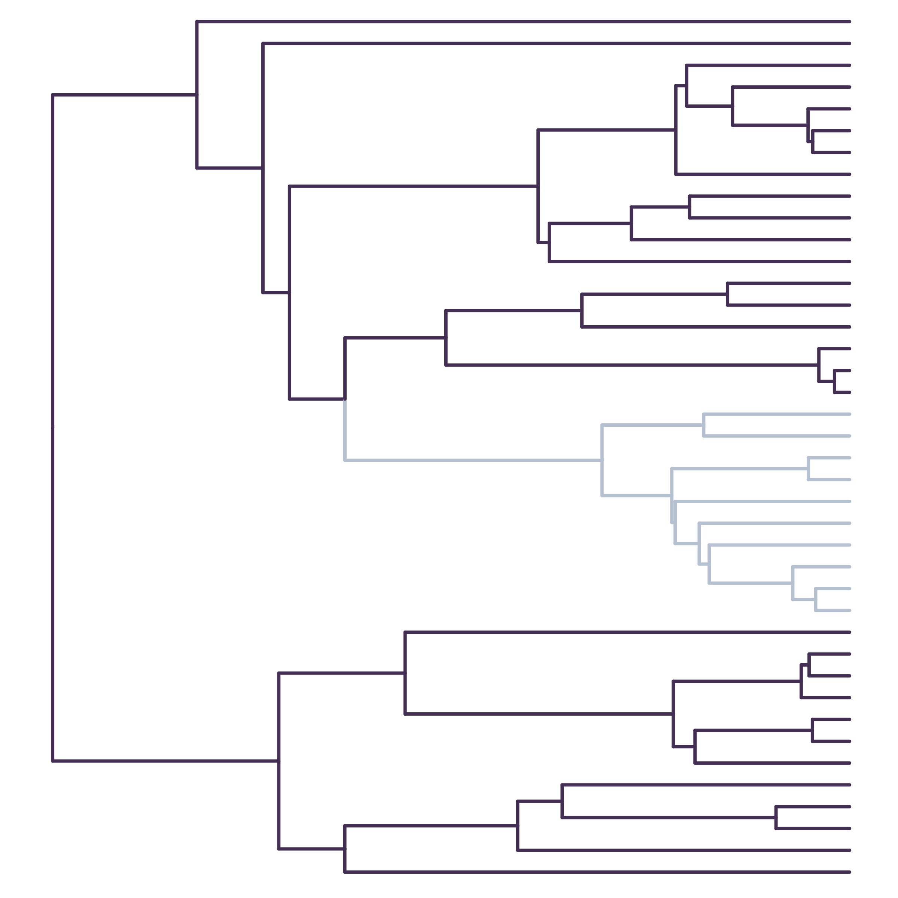
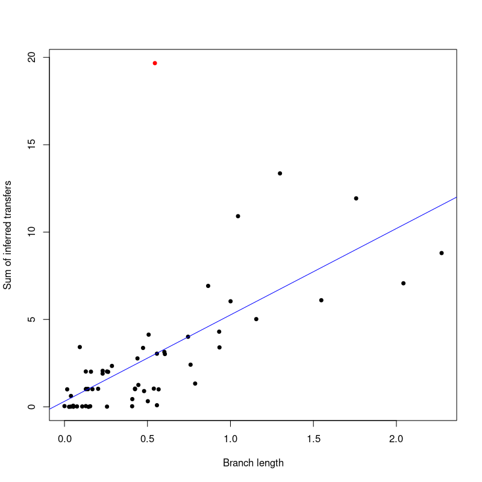

# Description
This repository is a companion to our [paper](https://www.biorxiv.org/content/10.1101/2024.12.11.627931v1.full.pdf), which demonstrated the relationship between horizontal gene transfers inferred from a branch of a species tree and the amount of unknown or extinct species this branch carries. It contains code to generate species trees under a birth-death model, as well as gene trees with horizontal gene transfers, and prune species to generate the so-called ghost species. By reconciling the pruned species trees with the gene trees, we obtain a certain amount of transfers departing from each branch of the species tree, which we show is related to the amount of ghost species carried by this branch. 

We also perform experiments on an empirical dataset of 36 Cyanobacteria. We remove all possible monophyletic group from the tree, and measure the variation in the number of HGT inferred to come from the branch carrying the ghost group (induced donor). 
 
# Simulation
Below is a species tree obtained after removing a clade, as well as a plot showing that the branch carrying an extinct clade (in red) donates an amount of transfers that is excessive relative to its branch length.



# Empirical data: Cyanobacteria
Download the [cyano data](https://drive.google.com/file/d/1-XrzpUkuWGK1BqA04kbWXQ_cYpB_kQFQ/view?usp=drive_link)
Decompress the ```cyano.tar.zst``` file, then run the scripts ```EffectDepthSprFinal.R``` and ```CyanoExperiment.R``` to reproduce the experimental results.

# Requirements
To reproduce our experiments, you need the following
- [ALE](https://github.com/ssolo/ALE/blob/master/INSTALL.md)
- python=="3.12.6"

Python packages:
- ete3==3.1.3
- pandas==2.2.3
- six==1.17.0
- numpy==2.2.0
- matplotlib==3.9.3
- scipy==1.14.1
- networkx==3.4.2
- pyvolve==1.1.0

R packages:
- ape
- ggtree
# Run
```bash simulate_ghost.sh```

The results are in the pdf files, or the png files generated by the program.
 Cyano